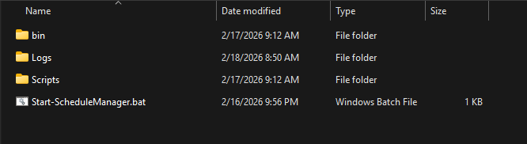
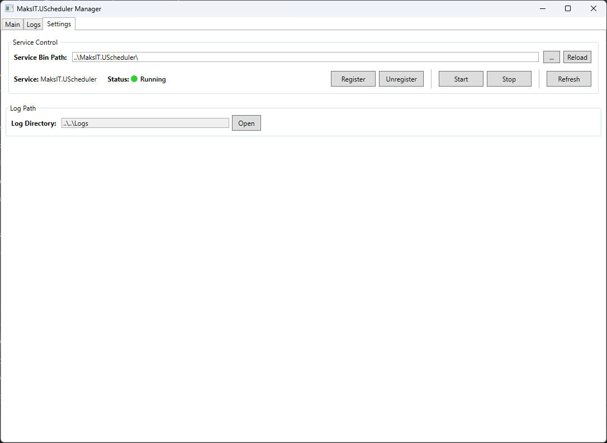
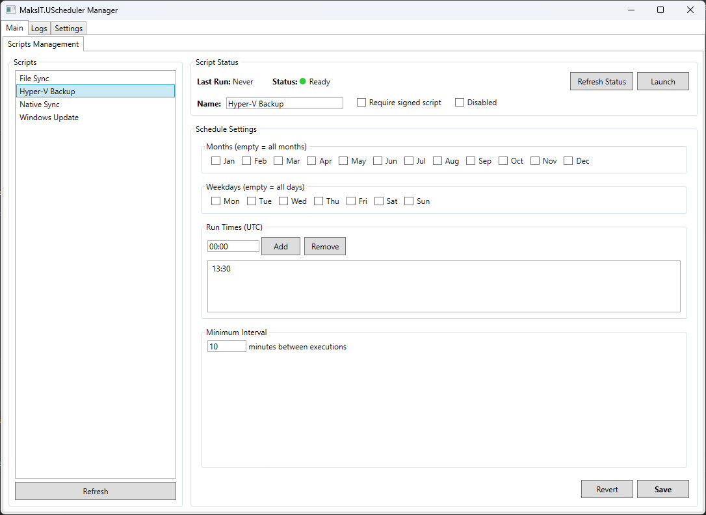
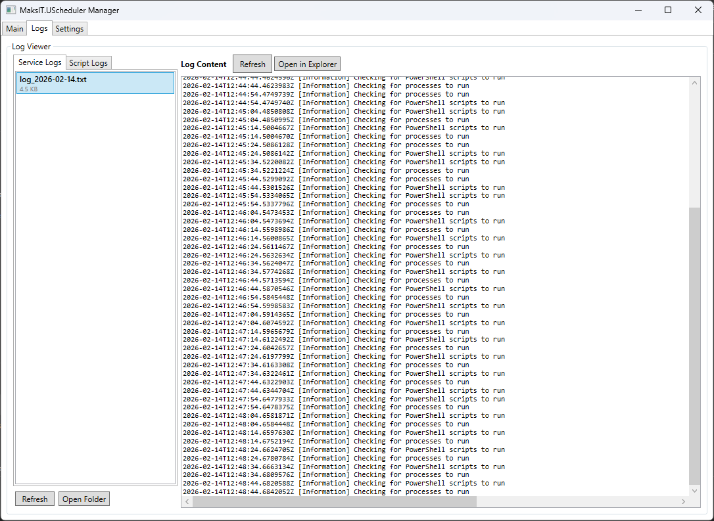
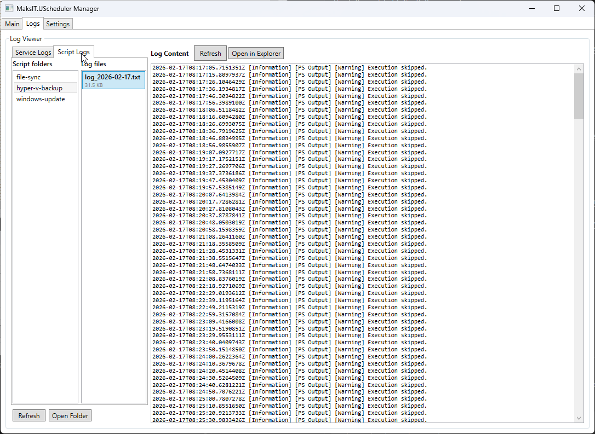

# MaksIT Unified Scheduler Service


A modern scheduler built on **.NET 10** for running PowerShell scripts and console applications on **Windows and Linux**.
Designed for system administrators — and also for those who *feel like* system administrators — who need a predictable, resilient, and secure background execution environment.

> **Tip:** A graphical [UScheduler UI](#uscheduler-ui) is included for service registration, script scheduling, and log viewing — no command-line required.

See [CONTRIBUTING.md](CONTRIBUTING.md) for development setup, commit format, and release workflow.

---

## Table of Contents

- [MaksIT Unified Scheduler Service](#maksit-unified-scheduler-service)
  - [Table of Contents](#table-of-contents)
  - [Scripts Examples](#scripts-examples)
  - [Features at a Glance](#features-at-a-glance)
  - [Installation](#installation)
    - [Install layout](#install-layout)
    - [Using CLI Commands](#using-cli-commands)
    - [Using sc.exe (Windows)](#using-scexe-windows)
    - [Using systemd (Linux)](#using-systemd-linux)
  - [UScheduler UI](#uscheduler-ui)
    - [Getting Started](#getting-started)
    - [Settings View](#settings-view)
    - [Main View — Schedule Management](#main-view--schedule-management)
    - [Service Logs View](#service-logs-view)
    - [Script Logs View](#script-logs-view)
  - [Configuration](#configuration)
    - [Machine-wide `settings.json`](#machine-wide-settingsjson)
    - [Path Resolution](#path-resolution)
    - [Log Levels](#log-levels)
    - [PowerShell Scripts](#powershell-scripts)
    - [Processes](#processes)
  - [How It Works](#how-it-works)
    - [PowerShell Execution Parameters](#powershell-execution-parameters)
    - [Execution Model](#execution-model)
  - [Reusable Scheduler Module (`SchedulerTemplate.psm1`)](#reusable-scheduler-module-schedulertemplatepsm1)
    - [Exported Functions](#exported-functions)
    - [Module Version](#module-version)
    - [Example usage](#example-usage)
  - [Security](#security)
  - [Logging](#logging)
  - [Testing](#testing)
    - [Running Tests](#running-tests)
    - [Code Coverage](#code-coverage)
    - [Test Structure](#test-structure)
  - [Contact](#contact)
  - [License](#license)

## Scripts Examples

> **Note:** These examples are **bundled with the release** and copied to `C:\MaksIT\Scripts` on first install **only if that folder or script is not already present**. Existing files and script folders are never overwritten or merged. They are listed in the default configuration but **disabled by default**. To enable an example, set `"Disabled": false` in `%ProgramData%\MaksIT\UScheduler\settings.json` (or use the UI).

- [Hyper-V Backup](./src/Scripts/HyperV-Backup/README.md) - Production-ready Hyper-V VM backup solution with scheduling and retention management
- [Native-Sync](./src/Scripts/Native-Sync/README.md) - Production-ready file synchronization solution using pure PowerShell with no external dependencies
- [File-Sync](./src/Scripts/File-Sync/README.md) - [FreeFileSync](https://freefilesync.org/) batch job execution
- [Windows-Update](./src/Scripts/Windows-Update/README.md) - Production-ready Windows Update automation solution using pure PowerShell
- [Scheduler Template Module](./src/Scripts/SchedulerTemplate.psm1)

---

## Features at a Glance

* **.NET 10 Worker Service** – clean, robust, stable.
* **Fully portable** – relocate between machines without reconfiguration.
* **Windows and Linux** – Windows SCM or systemd; Avalonia UI on both.
* **Strongly typed configuration** via machine-wide `settings.json` (ProgramData).
* **Parallel execution** – PowerShell scripts & executables run concurrently using RunspacePool and Task.WhenAll.
* **Relative path support** – script paths can be relative to `C:\MaksIT\Scripts`.
* **Signature enforcement** (AllSigned by default).
* **Automatic restart-on-failure** for supervised processes.
* **Extensible logging** (file + console + Windows EventLog).
* **Built-in CLI** for service management (`--install`, `--uninstall`, `--start`, `--stop`, `--status`).
* **Reusable scheduling module**: `SchedulerTemplate.psm1`.
* **Thread-isolated architecture** — individual failures do not affect others.

---

## Installation

### Install layout

| Location | Purpose | Who can write |
|----------|---------|----------------|
| `C:\Program Files\MaksIT\UScheduler` | Worker (`MaksIT.UScheduler.exe`) and UI (`MaksIT.UScheduler.UI.exe`) | Administrators |
| `C:\MaksIT\Scripts` | Scheduled scripts (all users). Install copies bundled examples only into missing folders; existing scripts are never overwritten. | Users (after install) |
| `C:\MaksIT\Logs` | Service and script logs | Users (after install) |
| `%ProgramData%\MaksIT\UScheduler\settings.json` | Shared schedule configuration | Users (after install) |
| `%AppData%\MaksIT\UScheduler\settings.json` | Per-user UI prefs (service bin path override) | Current user |

Registering the service (or `MaksIT.UScheduler --prepare-data`) creates the `C:\MaksIT` and ProgramData folders and grants the Users group modify rights, so the UI can stay unelevated.

### Using CLI Commands

The executable includes built-in service management commands. Run as Administrator (Windows) or root (Linux):

```powershell
# Install the service (auto-start / systemd enable)
MaksIT.UScheduler --install

# Start the service
MaksIT.UScheduler --start

# Check service status
MaksIT.UScheduler --status

# Stop the service
MaksIT.UScheduler --stop

# Uninstall the service
MaksIT.UScheduler --uninstall

# Show help
MaksIT.UScheduler --help

# Create data folders and ACLs without installing the service
MaksIT.UScheduler --prepare-data
```

On Windows the file is `MaksIT.UScheduler.exe`.

| Command | Short | Description |
|---------|-------|-------------|
| `--install` | `-i` | Install the service (Windows SCM or systemd) |
| `--uninstall` | `-u` | Stop and remove the service |
| `--start` | | Start the service |
| `--stop` | | Stop the service |
| `--status` | | Query service status |
| `--prepare-data` | | Create `C:\MaksIT\Scripts`, `C:\MaksIT\Logs`, and shared settings (elevated) |
| `--help` | `-h` | Show help message |

> **Note:** Service management commands require administrator / root privileges.

### Using sc.exe (Windows)

Alternatively, use Windows Service Control Manager directly:

```powershell
sc.exe create "MaksIT.UScheduler" binPath= "C:\Path\To\MaksIT.UScheduler.exe" start= auto
sc.exe start "MaksIT.UScheduler"
```

### Using systemd (Linux)

`--install` writes `/etc/systemd/system/MaksIT.UScheduler.service` (`Type=notify`) and enables the unit. You can also:

```bash
sudo systemctl enable --now MaksIT.UScheduler
sudo systemctl status MaksIT.UScheduler
```

To uninstall:

```powershell
sc.exe stop "MaksIT.UScheduler"
sc.exe delete "MaksIT.UScheduler"
```

---

## UScheduler UI

The UI is an **Avalonia** desktop app (Windows and Linux) for service registration, script schedules, and log viewing. Launch `MaksIT.UScheduler.UI.exe` from Program Files — it runs **without** administrator rights. Register, start, stop, and unregister prompt for elevation in place; the window stays open.

### Getting Started

When you unpack the portable zip, launch `MaksIT.UScheduler.UI.exe`. GitHub releases also ship a Windows setup exe (installs worker + UI to `C:\Program Files\MaksIT\UScheduler`) and a Flatpak of the UI.



> **Note:** Service management (register, start, stop, unregister) prompts for administrator approval without restarting the UI. Schedule edits go to `%ProgramData%\MaksIT\UScheduler\settings.json` and do not require elevation after the first install.

### Settings View

The Settings view is your starting point for configuring UScheduler.



| Feature | Description |
|---------|-------------|
| **Service Bin Path** | Path to the worker folder (auto-detected from Program Files or the UI directory; override stored in `%AppData%/MaksIT/UScheduler/settings.json`) |
| **Service Status** | Real-time status indicator (Running, Stopped, Starting, Stopping, Paused, Not Installed) |
| **Register/Unregister** | Install or remove the Windows service or systemd unit (UAC / polkit prompt, UI stays open) |
| **Start/Stop** | Control the service state (same in-app elevation) |
| **Refresh** | Update the current service status display |
| **Reload Settings** | Refresh shared configuration from `%ProgramData%\MaksIT\UScheduler\settings.json` |

### Main View — Schedule Management

The Main view allows you to manage script schedules and execution settings.



**Script List Panel:**
- Lists all PowerShell scripts configured in shared `settings.json`
- Each row shows a description and which hosts it supports
- Scripts that cannot run on this OS stay listed but are grayed out
- Select a script to view and edit its schedule

**Script Configuration:**

| Setting | Description |
|---------|-------------|
| **Name** | Display name for the script |
| **Is Signed** | Require script to be digitally signed (AllSigned policy) |
| **Disabled** | Skip this script during scheduled execution |

**Schedule Configuration:**

| Setting | Description |
|---------|-------------|
| **Run Month** | Select specific months to run (empty = every month) |
| **Run Weekday** | Select specific days of the week (empty = every day) |
| **Run Time** | Add/remove specific execution times (HH:mm format) |
| **Min Interval** | Minimum minutes between executions (prevents duplicate runs) |

**Actions:**
- **Save** — Persist schedule changes to `scriptsettings.json`
- **Revert** — Discard unsaved changes
- **Launch** — Execute the script immediately via its `.bat` file

**Script Status:**
- View lock file status (indicates if script is currently running)
- View last execution timestamp
- Remove stale lock files from crashed scripts

### Service Logs View

Monitor the UScheduler service activity and troubleshoot issues.



Features:
- Browse service log files sorted by date
- View log content directly in the application
- Open log files in Windows Explorer
- Refresh logs to see latest entries

### Script Logs View

View execution logs for individual scheduled scripts.



Features:
- Browse log folders organized by script name
- Select and view individual log files
- Track script execution history and errors
- Open logs in Explorer for external tools


## Configuration

### Machine-wide `settings.json`

Host logging (log levels, Event Log source) stays in shipped `appsettings.json` next to `MaksIT.UScheduler.exe` under Program Files. Schedule configuration is **not** written there — a leftover `Configuration` block is copied once into the machine-wide file:

`%ProgramData%\MaksIT\UScheduler\settings.json`

```json
{
  "Configuration": {
    "ServiceName": "MaksIT.UScheduler",
    "LogDir": "C:\\MaksIT\\Logs",
    "ScriptsDir": "C:\\MaksIT\\Scripts",

    "Powershell": [
      { "Path": "File-Sync\\file-sync.ps1", "IsSigned": true, "Disabled": false },
      { "Path": "C:\\MaksIT\\Scripts\\AnotherScript.ps1", "IsSigned": false, "Disabled": true, "Platforms": ["Windows"], "Description": "Windows-only example" }
    ],

    "Processes": [
      { "Path": "C:\\Tools\\MyApp.exe", "Args": ["--option"], "RestartOnFailure": true, "Disabled": false }
    ]
  }
}
```

> **Note:** `ServiceName`, `LogDir`, and `ScriptsDir` are optional. Defaults: `"MaksIT.UScheduler"`, `C:\MaksIT\Logs`, and `C:\MaksIT\Scripts`.

### Path Resolution

Paths can be either absolute or relative:

| Path Type | Example | Resolved To |
|-----------|---------|-------------|
| Absolute | `C:\MaksIT\Scripts\backup.ps1` | `C:\MaksIT\Scripts\backup.ps1` |
| Relative | `File-Sync\file-sync.ps1` | `{ScriptsDir}\File-Sync\file-sync.ps1` (`C:\MaksIT\Scripts` by default) |

Relative **script** paths are resolved against `ScriptsDir`. Relative **process** paths are still resolved against the worker's install directory.

### Log Levels

The `"Default": "Information"` setting controls the minimum severity of messages that get logged. Available levels (from most to least verbose):

| Level | Description |
|-------|-------------|
| `Trace` | Most detailed, for debugging internals |
| `Debug` | Debugging information |
| `Information` | General operational events (recommended default) |
| `Warning` | Abnormal or unexpected events |
| `Error` | Errors and exceptions |
| `Critical` | Critical failures requiring immediate attention |
| `None` | Disables logging |

### PowerShell Scripts

| Property | Type | Default | Description |
|----------|------|---------|-------------|
| `Path` | string | required | Path to `.ps1` file (absolute or relative) |
| `Name` | string | optional | Display name in the UI |
| `Description` | string | optional | Short text under the name in the script list |
| `Platforms` | string[] | empty (all) | `Windows` and/or `Linux`. Empty = both. The worker skips scripts that do not match the host; the list grays them out. |
| `IsSigned` | bool | `true` | `true` enforces AllSigned, `false` runs unrestricted |
| `Disabled` | bool | `false` | `true` skips this script during execution |

### Processes

| Property | Type | Default | Description |
|----------|------|---------|-------------|
| `Path` | string | required | Path to executable (absolute or relative) |
| `Args` | string[] | `null` | Command-line arguments |
| `RestartOnFailure` | bool | `false` | Restart process if it exits with non-zero code |
| `Disabled` | bool | `false` | `true` skips this process during execution |

---

## How It Works

Each script or process is executed in its own managed thread.

### PowerShell Execution Parameters

```csharp
myCommand.Parameters.Add(new CommandParameter("Automated", true));
myCommand.Parameters.Add(new CommandParameter("CurrentDateTimeUtc", DateTime.UtcNow.ToString("o")));
```

Inside the script:

```powershell
param (
    [switch]$Automated,
    [string]$CurrentDateTimeUtc
)
```

### Execution Model

Scripts and processes run **in parallel** using:

- **PowerShell**: `RunspacePool` (up to CPU core count concurrent runspaces)
- **Processes**: `Task.WhenAll` for concurrent process execution

```
Unified Scheduler Service
├── PSScriptBackgroundService (RunspacePool)
│   ├── ScriptA.ps1     ─┐
│   ├── ScriptB.ps1     ─┼─ Parallel execution
│   └── ScriptC.ps1     ─┘
└── ProcessBackgroundService (Task.WhenAll)
    ├── ProgramA.exe    ─┐
    ├── ProgramB.exe    ─┼─ Parallel execution
    └── ProgramC.exe    ─┘
```

- A failure in one script/process **never stops the service** or other components.
- The same script/process won't run twice concurrently (protected by "already running" check).
- Execution cycle repeats every 10 seconds.

---

## Reusable Scheduler Module (`SchedulerTemplate.psm1`)

This module provides:

* Scheduling by:

  * Month
  * Weekday
  * Exact time(s)
  * Minimum interval
* Automatic lock file (no concurrent execution)
* Last-run file tracking
* Unified callback execution pattern

### Exported Functions

| Function | Description |
|----------|-------------|
| `Write-Log` | Logging with timestamp, level (Info/Success/Warning/Error), and color support |
| `Invoke-ScheduledExecution` | Main scheduler — checks schedule, manages locks, runs callback |
| `Get-CredentialFromEnvVar` | Retrieves credentials from Base64-encoded machine environment variables |
| `Test-UNCPath` | Validates whether a path is a UNC path |
| `Send-EmailNotification` | Sends SMTP email with optional SSL and credential support |

### Module Version

The module exports `$ModuleVersion` and `$ModuleDate` for version tracking.

### Example usage

```powershell
param (
    [switch]$Automated,
    [string]$CurrentDateTimeUtc
)

Import-Module "$PSScriptRoot\..\SchedulerTemplate.psm1" -Force

$Config = @{
    RunMonth = @()
    RunWeekday = @()
    RunTime = @("22:52")
    MinIntervalMinutes = 10
}

function Start-BusinessLogic {
     Write-Log "Executing business logic..." -Automated:$Automated
}

Invoke-ScheduledExecution -Config $Config -Automated:$Automated -CurrentDateTimeUtc $CurrentDateTimeUtc -ScriptBlock {
    Start-BusinessLogic
}
```

**Workflow for new scheduled scripts:**

1. Copy template
2. Modify `$Config`
3. Implement `Start-BusinessLogic`
4. Add script to `%ProgramData%\MaksIT\UScheduler\settings.json` (or use the UI)

That’s it — the full scheduling engine is reused automatically.

---

## Security

* Scripts run with **AllSigned** execution policy by default.
* Set `IsSigned: false` to use **Unrestricted** policy (not recommended for production).
* Scripts are auto-unblocked before execution (Zone.Identifier removed).
* Signature validation ensures only trusted scripts execute.

---

## Logging

* **Console logging** — standard output
* **File logging** — written to `LogDir` (default: `C:\MaksIT\Logs`)
* **Windows EventLog** — events logged to Application log under `MaksIT.UScheduler` source
* All events (start, stop, crash, restart, error, skip) are logged

---

## Testing

The project includes a comprehensive test suite using **xUnit** and **Moq** for unit testing.

### Running Tests

Use the RepoUtils test engine (recommended):

```powershell
.\utils\Invoke-TestEngine.bat
```

Or run tests directly:

```powershell
# Run all tests
dotnet test src/MaksIT.UScheduler.Tests

# Run with verbose output
dotnet test src/MaksIT.UScheduler.Tests --verbosity normal
```

### Code Coverage

Coverage badges in `README.md` are rewritten by the test engine (`CoverageBadges` with `badgeFormat: shields`). After changing tests or coverage, rerun:

```powershell
.\utils\Invoke-TestEngine.bat
```

Commit the updated README shields.io badge URLs with the test or release work.

### Test Structure

| Test Class | Coverage |
|------------|----------|
| `ConfigurationTests` | Configuration POCOs and default values |
| `ConfigurationFileServiceTests` | Shared ProgramData settings.json seed/copy/save |
| `HostDataDirectoriesTests` | Seed script copy skips existing folders and files |
| `ProcessBackgroundServiceTests` | Process execution lifecycle and error handling |
| `PSScriptBackgroundServiceTests` | PowerShell script execution and signature validation |

---

## Contact

**Maksym Sadovnychyy** — [MAKS-IT](https://github.com/MAKS-IT-COM)  
Email: maksym.sadovnychyy@gmail.com

---

## License

This project is licensed under the MIT License. See [LICENSE.md](LICENSE.md) for details.

---
