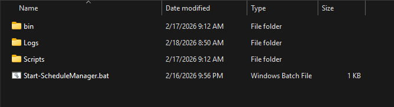
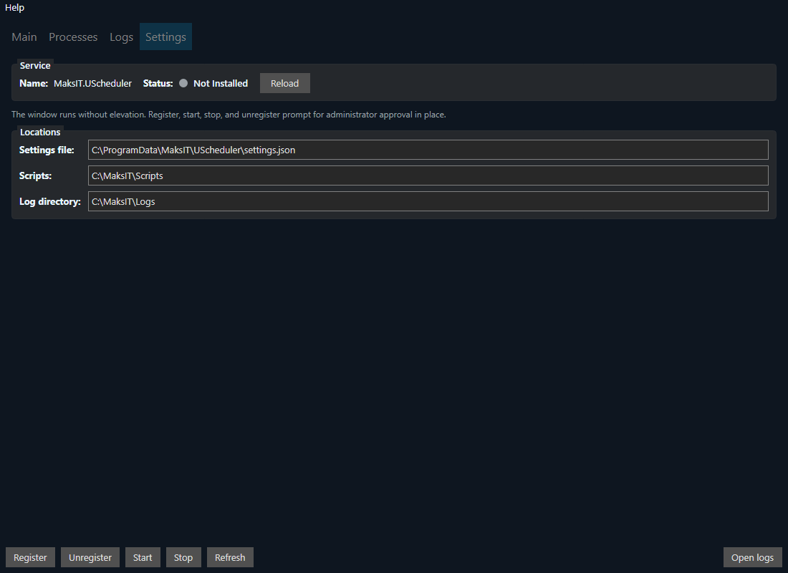
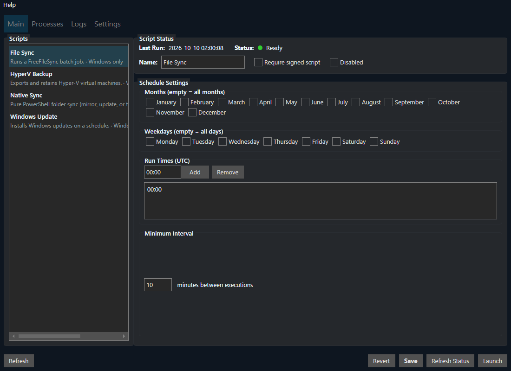
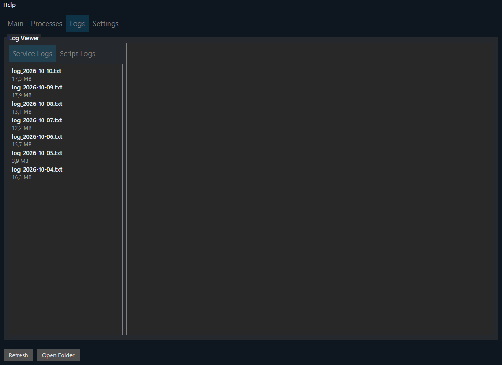
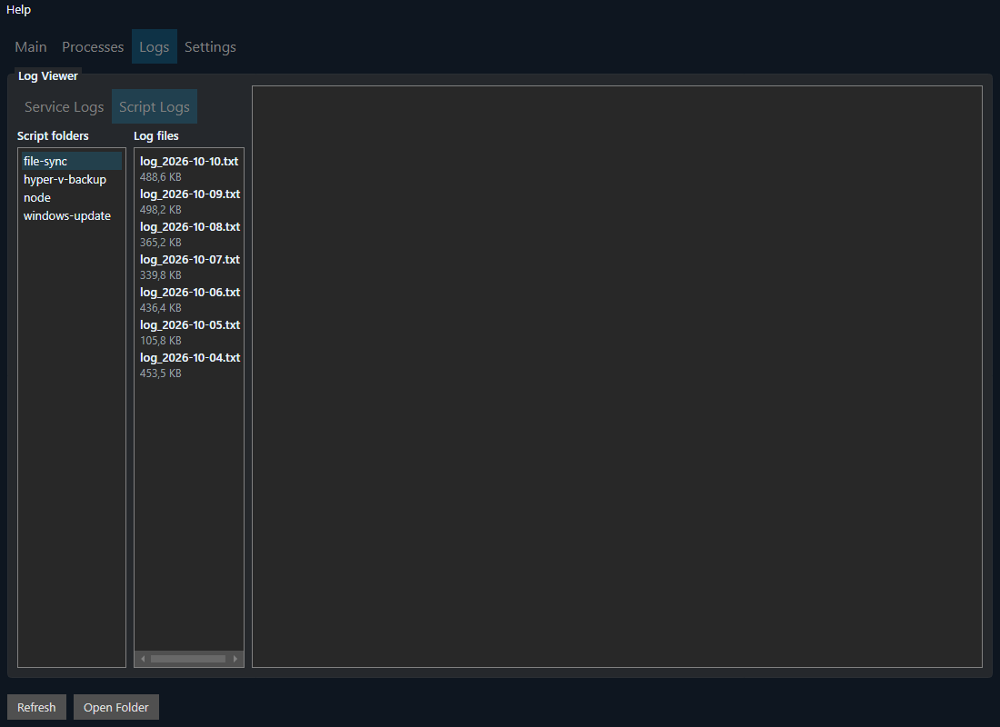
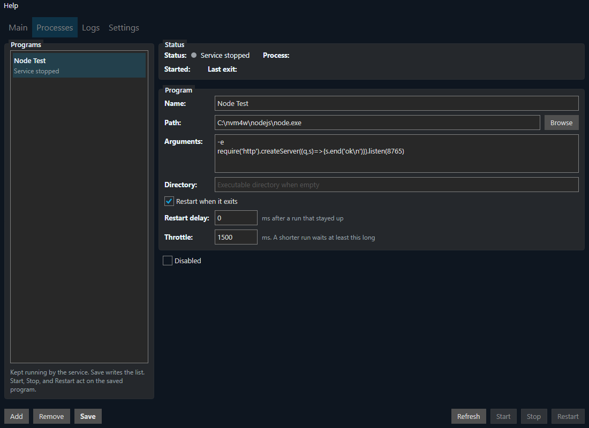

# MaksIT Unified Scheduler Service


A modern scheduler built on **.NET 10** for running PowerShell scripts and console applications on **Windows and Linux**.
Designed for system administrators — and also for those who *feel like* system administrators — who need a predictable, resilient, and secure background execution environment.

> **Tip:** Open [UScheduler](#uscheduler-ui) for service registration, script scheduling, and log viewing. The same program runs as the Windows service or systemd unit.

See [CONTRIBUTING.md](CONTRIBUTING.md) for development setup, commit format, and release workflow.

---

## Table of Contents

- [MaksIT Unified Scheduler Service](#maksit-unified-scheduler-service)
  - [Table of Contents](#table-of-contents)
  - [Scripts Examples](#scripts-examples)
  - [Features at a Glance](#features-at-a-glance)
  - [Installation](#installation)
    - [Install layout](#install-layout)
    - [Using CLI Commands](#using-cli-commands)
    - [Using sc.exe (Windows)](#using-scexe-windows)
    - [Using systemd (Linux)](#using-systemd-linux)
  - [UScheduler UI](#uscheduler-ui)
    - [Getting Started](#getting-started)
    - [Settings View](#settings-view)
    - [Main View — Schedule Management](#main-view--schedule-management)
    - [Service Logs View](#service-logs-view)
    - [Script Logs View](#script-logs-view)
    - [Processes](#processes)
  - [Configuration](#configuration)
    - [Machine-wide `settings.json`](#machine-wide-settingsjson)
    - [Path Resolution](#path-resolution)
    - [Log Levels](#log-levels)
    - [PowerShell Scripts](#powershell-scripts)
    - [Processes](#processes)
  - [How It Works](#how-it-works)
    - [PowerShell Execution Parameters](#powershell-execution-parameters)
    - [Execution Model](#execution-model)
  - [Reusable Scheduler Module (`SchedulerTemplate.psm1`)](#reusable-scheduler-module-schedulertemplatepsm1)
    - [Exported Functions](#exported-functions)
    - [Module Version](#module-version)
    - [Example usage](#example-usage)
  - [Security](#security)
  - [Logging](#logging)
  - [Testing](#testing)
    - [Running Tests](#running-tests)
    - [Code Coverage](#code-coverage)
    - [Test Structure](#test-structure)
  - [Contact](#contact)
  - [License](#license)

## Scripts Examples

> **Note:** These examples are **bundled with the release** and copied to `C:\MaksIT\Scripts` (standard) or the install folder's `Scripts` directory (portable) by the Windows setup exe (and by `--install` / `--prepare-data`) **only if that folder or script is not already present**. Existing files and script folders are never overwritten or merged. They are listed in the default configuration but **disabled by default**. To enable an example, set `"Disabled": false` in the shared `settings.json` (or use the UI).

- [Hyper-V Backup](./src/Scripts/HyperV-Backup/README.md) - Production-ready Hyper-V VM backup solution with scheduling and retention management
- [Native-Sync](./src/Scripts/Native-Sync/README.md) - Production-ready file synchronization solution using pure PowerShell with no external dependencies
- [File-Sync](./src/Scripts/File-Sync/README.md) - [FreeFileSync](https://freefilesync.org/) batch job execution
- [Windows-Update](./src/Scripts/Windows-Update/README.md) - Production-ready Windows Update automation solution using pure PowerShell
- [Scheduler Template Module](./src/Scripts/SchedulerTemplate.psm1)

---

## Features at a Glance

* **.NET 10 Worker Service** – clean, robust, stable.
* **Fully portable** – relocate between machines without reconfiguration.
* **Windows and Linux** – Windows SCM or systemd; Avalonia UI on both.
* **Strongly typed configuration** via machine-wide `settings.json` (ProgramData).
* **Parallel execution** – PowerShell scripts run together in a RunspacePool. Console programs run side by side under the service and do not block each other.
* **Relative path support** – script paths can be relative to `C:\MaksIT\Scripts`.
* **Signature enforcement** (AllSigned by default).
* **Service wrapper for console programs** – a configured program starts with the service, restarts when it exits, and stops when the service stops.
* **Extensible logging** (file + console + Windows EventLog).
* **Built-in CLI** for service management (`--install`, `--uninstall`, `--start`, `--stop`, `--status`).
* **Reusable scheduling module**: `SchedulerTemplate.psm1`.
* **Thread-isolated architecture** — individual failures do not affect others.

---

## Installation

### Install layout

The Windows setup exe lets you choose **Standard** or **Portable**.

**Standard** (default):

| Location | Purpose | Who can write |
|----------|---------|----------------|
| `C:\Program Files\MaksIT\UScheduler` | `MaksIT.UScheduler.UI.exe` (window, and the service when started with `--service`) | Administrators |
| `C:\MaksIT\Scripts` | Scheduled scripts (all users). The Windows setup exe (and `--install` / `--prepare-data`) copies bundled examples only into missing folders; existing scripts are never overwritten. | Users (after install) |
| `C:\MaksIT\Logs` | Service and script logs | Users (after install) |
| `%ProgramData%\MaksIT\UScheduler\settings.json` | Shared schedule configuration | Users (after install) |
| `%AppData%\MaksIT\UScheduler\settings.json` | Per-user UI prefs (window size, position, and What's New) | Current user |

**Portable** (everything in one folder):

| Location | Purpose |
|----------|---------|
| *Install folder* (you choose it) | `MaksIT.UScheduler.UI.exe` |
| *Install folder*`\Scripts` | Scheduled scripts |
| *Install folder*`\Logs` | Service and script logs |
| *Install folder*`\Data\settings.json` | Shared schedule configuration |
| *Install folder*`\Data\ui-settings.json` | UI prefs |

A `portable` file in that folder (or a parent folder) marks the layout. Pick a writable location such as `C:\MaksIT\UScheduler` if you do not want Program Files. The Users group is granted modify rights on `Scripts`, `Logs`, and `Data` so the UI can stay unelevated.

The Windows setup exe, registering the service, or `MaksIT.UScheduler.UI --prepare-data` creates the data folders, copies bundled example scripts when missing, and grants the Users group modify rights so the window can stay unelevated. Add `--portable` to keep data next to the program instead of `C:\MaksIT` and ProgramData.

### Using CLI Commands

The executable includes built-in service management commands. Run as Administrator (Windows) or root (Linux):

```powershell
# Install the service (auto-start / systemd enable). The service runs this program with --service.
MaksIT.UScheduler.UI --install

# Start the service
MaksIT.UScheduler.UI --start

# Check service status
MaksIT.UScheduler.UI --status

# Stop the service
MaksIT.UScheduler.UI --stop

# Uninstall the service
MaksIT.UScheduler.UI --uninstall

# Show help
MaksIT.UScheduler.UI --help

# Create data folders and ACLs without installing the service
MaksIT.UScheduler.UI --prepare-data

# Portable layout: scripts, logs, and settings next to the executable
MaksIT.UScheduler.UI --prepare-data --portable
```

On Windows the file is `MaksIT.UScheduler.UI.exe`. With no arguments it opens the window.

| Command | Short | Description |
|---------|-------|-------------|
| `--service` | | Run the scheduler. Windows SCM and systemd use this; it does not open a window |
| `--install` | `-i` | Install the service (Windows SCM or systemd) |
| `--uninstall` | `-u` | Stop and remove the service |
| `--start` | | Start the service |
| `--stop` | | Stop the service |
| `--status` | | Query service status |
| `--prepare-data` | | Create scripts, logs, and shared settings (elevated) |
| `--portable` | | With `--install` / `--prepare-data`: keep data in the install folder |
| `--help` | `-h` | Show help message |

> **Note:** Service management commands require administrator / root privileges.

### Using sc.exe (Windows)

Alternatively, use Windows Service Control Manager directly:

```powershell
sc.exe create "MaksIT.UScheduler" binPath= "\"C:\Path\To\MaksIT.UScheduler.UI.exe\" --service" start= auto
sc.exe start "MaksIT.UScheduler"
```

### Using systemd (Linux)

`--install` writes `/etc/systemd/system/MaksIT.UScheduler.service` (`Type=notify`) and enables the unit. You can also:

```bash
sudo systemctl enable --now MaksIT.UScheduler
sudo systemctl status MaksIT.UScheduler
```

To uninstall:

```powershell
sc.exe stop "MaksIT.UScheduler"
sc.exe delete "MaksIT.UScheduler"
```

---

## UScheduler UI

UScheduler is an **Avalonia** desktop app (Windows and Linux) for service registration, script schedules, and log viewing. Launch `MaksIT.UScheduler.UI.exe` from Program Files — the window runs **without** administrator rights. Register, start, stop, and unregister prompt for elevation in place; the window stays open. The installed service is this same program, started with `--service`. After an upgrade, What's New lists additions since the version you last opened.

### Getting Started

When you unpack the portable zip, launch `MaksIT.UScheduler.UI.exe` (or `Start-UScheduler.bat`). The zip is a portable layout: scripts, logs, and settings stay in the extracted folder. GitHub releases also ship a Windows setup exe (choose Standard or Portable on the install page) and a Flatpak of the window.

#### Linux (Flatpak)

**User** (this account only):

```bash
flatpak install --user ./maksit-uscheduler-{version}.flatpak
flatpak run com.maks_it.uscheduler
```

**System** (all users):

```bash
sudo flatpak install --system ./maksit-uscheduler-{version}.flatpak
flatpak run com.maks_it.uscheduler
```

Uninstall: `flatpak uninstall --user com.maks_it.uscheduler` or `sudo flatpak uninstall --system com.maks_it.uscheduler`.

The previous id `com.maks_it.UScheduler` is replaced by this lowercase id. Uninstall the old app before installing the new bundle if it was installed.

If GNOME or KDE does not show a launcher icon, `flatpak run` may warn that `/var/lib/flatpak/exports/share` and `~/.local/share/flatpak/exports/share` are not on `XDG_DATA_DIRS`. Log out and back in once so the session picks up those paths.

Linux uses X11/XWayland (Avalonia native Wayland still hangs on GNOME). The sandbox grants `--filesystem=home` for scripts and logs. The Flatpak is the window; register the same program with systemd on the host when it should run at boot. AppStream and the desktop file live in [`data/`](data/).



> **Note:** Service management (register, start, stop, unregister) prompts for administrator approval without restarting the UI. Schedule edits go to `%ProgramData%\MaksIT\UScheduler\settings.json` on a standard install (or `Data\settings.json` next to a portable install) and do not require elevation after the first install.

### Settings View

The Settings view is your starting point for configuring UScheduler.

<!-- microsoft-store 2 -->


| Feature | Description |
|---------|-------------|
| **Service** | Installed service name and status (Running, Stopped, Starting, Stopping, Paused, Not Installed). The service is this same program |
| **Locations** | Settings file, scripts folder, and log directory used by the window and the service |
| **Register/Unregister** | Install or remove the Windows service or systemd unit (UAC / polkit prompt, UI stays open) |
| **Start/Stop** | Control the service state (same in-app elevation) |
| **Refresh** | Update the current service status display |
| **Reload** | Refresh the service status and the shared settings from `%ProgramData%\MaksIT\UScheduler\settings.json` (or `Data\settings.json` when portable) |
| **Open logs** | Open the log directory |

### Main View — Schedule Management

The Main view allows you to manage script schedules and execution settings.

<!-- microsoft-store 1 -->


**Script List Panel:**
- Lists all PowerShell scripts configured in shared `settings.json`
- Each row shows a description and which hosts it supports
- Scripts that cannot run on this OS stay listed but are grayed out
- Select a script to view and edit its schedule

**Script Configuration:**

| Setting | Description |
|---------|-------------|
| **Name** | Display name for the script |
| **Require signed script** | Require the script to be digitally signed (AllSigned policy) |
| **Disabled** | Skip this script during scheduled execution |

**Schedule Configuration:**

| Setting | Description |
|---------|-------------|
| **Run Month** | Select specific months to run (empty = every month) |
| **Run Weekday** | Select specific days of the week (empty = every day) |
| **Run Time** | Add/remove specific execution times (HH:mm format) |
| **Min Interval** | Minimum minutes between executions (prevents duplicate runs) |

**Actions:**
- **Save** — Persist schedule changes to `scriptsettings.json`
- **Revert** — Discard unsaved changes
- **Launch** — Ask the running service to start the script now. The window does not need administrator rights.

**Script Status:**
- View lock file status (indicates if script is currently running)
- View last execution timestamp
- Remove stale lock files from crashed scripts

### Service Logs View

Monitor the UScheduler service activity and troubleshoot issues.

<!-- microsoft-store 4 -->


Features:
- Browse service log files sorted by date
- View log content directly in the application
- **Open Folder** opens the log directory. With a file selected, **Show in folder** opens that file's folder
- Refresh logs to see latest entries

### Script Logs View

View execution logs for individual scheduled scripts.

<!-- microsoft-store 3 -->


Features:
- Browse log folders organized by script name
- Select and view individual log files
- Track script execution history and errors
- **Open Folder** opens the log directory. With a file selected, **Show in folder** opens that file's folder

### Processes

<!-- microsoft-store 5 -->


The Processes tab lists programs the service keeps running. Each row shows whether that program is running, restarting, stopped, or waiting for the service. Name is the label in the list. Add a program, set its path, arguments, and working directory, then Save. Remove drops it from the service. Start, Stop, and Restart ask the running service to act on the saved program. Stop leaves it down until Start, or until the service itself starts again.

## Configuration

### Machine-wide `settings.json`

Host logging (log levels, Event Log source) stays in shipped `appsettings.json` next to `MaksIT.UScheduler.UI.exe`. Schedule configuration is **not** written there — a leftover `Configuration` block is copied once into the machine-wide file:

`%ProgramData%\MaksIT\UScheduler\settings.json` (standard) or `{install folder}\Data\settings.json` (portable)

```json
{
  "Configuration": {
    "ServiceName": "MaksIT.UScheduler",
    "LogDir": "C:\\MaksIT\\Logs",
    "ScriptsDir": "C:\\MaksIT\\Scripts",

    "Powershell": [
      { "Path": "File-Sync\\file-sync.ps1", "IsSigned": true, "Disabled": false },
      { "Path": "C:\\MaksIT\\Scripts\\AnotherScript.ps1", "IsSigned": false, "Disabled": true, "Platforms": ["Windows"], "Description": "Windows-only example" }
    ],

    "Processes": [
      { "Name": "My app", "Path": "C:\\Tools\\MyApp.exe", "Args": ["--option"], "Directory": "C:\\Tools", "RestartOnFailure": true }
    ]
  }
}
```

> **Note:** `ServiceName`, `LogDir`, and `ScriptsDir` are optional. Defaults: `"MaksIT.UScheduler"`, `C:\MaksIT\Logs`, and `C:\MaksIT\Scripts`.

### Path Resolution

Paths can be either absolute or relative:

| Path Type | Example | Resolved To |
|-----------|---------|-------------|
| Absolute | `C:\MaksIT\Scripts\backup.ps1` | `C:\MaksIT\Scripts\backup.ps1` |
| Relative | `File-Sync\file-sync.ps1` | `{ScriptsDir}\File-Sync\file-sync.ps1` (`C:\MaksIT\Scripts` by default) |

Relative **script** paths are resolved against `ScriptsDir`. Relative **process** paths are still resolved against the install directory.

### Log Levels

The `"Default": "Information"` setting controls the minimum severity of messages that get logged. Available levels (from most to least verbose):

| Level | Description |
|-------|-------------|
| `Trace` | Most detailed, for debugging internals |
| `Debug` | Debugging information |
| `Information` | General operational events (recommended default) |
| `Warning` | Abnormal or unexpected events |
| `Error` | Errors and exceptions |
| `Critical` | Critical failures requiring immediate attention |
| `None` | Disables logging |

### PowerShell Scripts

| Property | Type | Default | Description |
|----------|------|---------|-------------|
| `Path` | string | required | Path to `.ps1` file (absolute or relative) |
| `Name` | string | optional | Display name in the UI |
| `Description` | string | optional | Short text under the name in the script list |
| `Platforms` | string[] | empty (all) | `Windows` and/or `Linux`. Empty = both. The service skips scripts that do not match the host; the list grays them out. |
| `IsSigned` | bool | `true` | `true` enforces AllSigned, `false` runs unrestricted |
| `Disabled` | bool | `false` | `true` skips this script during execution |

### Processes

A program listed here is kept running under the service, in the role filled by a tool such as NSSM. It is not on the script schedule. The Processes tab edits this list.

| Property | Type | Default | Description |
|----------|------|---------|-------------|
| `Name` | string | empty | Label in the Processes list. Empty uses the executable file name |
| `Path` | string | required | Path to the executable (absolute, or relative to the install directory) |
| `Args` | string[] | `null` | Command-line arguments |
| `Directory` | string | empty | Working directory. Empty uses the executable's own directory |
| `RestartOnFailure` | bool | `true` | `true` starts the program again after any exit. `false` leaves it stopped |
| `RestartDelayMs` | number | `0` | Wait before a restart after a run that lasted at least `ThrottleMs` |
| `ThrottleMs` | number | `1500` | A shorter run waits at least this long before the next start, and longer if it keeps exiting immediately, up to one minute |
| `Disabled` | bool | `false` | `true` does not start this program |

---

## How It Works

Each script or process is executed in its own managed thread.

### PowerShell Execution Parameters

```csharp
myCommand.Parameters.Add(new CommandParameter("Automated", true));
myCommand.Parameters.Add(new CommandParameter("CurrentDateTimeUtc", DateTime.UtcNow.ToString("o")));
```

Inside the script:

```powershell
param (
    [switch]$Automated,
    [string]$CurrentDateTimeUtc
)
```

### Execution Model

Scripts and processes run **in parallel**:

- **PowerShell**: `RunspacePool` (up to CPU core count concurrent runspaces). The check waits until that round of scripts finishes, then runs again after 10 seconds.
- **Processes**: each configured program is a service of its own. It starts when UScheduler starts, and a program that is still running is left alone. Settings are checked again after 10 seconds.

```
Unified Scheduler Service
├── PSScriptBackgroundService (RunspacePool)
│   ├── ScriptA.ps1     ─┐
│   ├── ScriptB.ps1     ─┼─ Parallel execution
│   └── ScriptC.ps1     ─┘
└── ProcessBackgroundService
    ├── ProgramA.exe    ─┐
    ├── ProgramB.exe    ─┼─ Parallel execution
    └── ProgramC.exe    ─┘
```

- A failure in one script or program **never stops the service** or the others.
- The same script or program is not started twice while it is still running.
- Stopping the service stops the programs too.
- With `RestartOnFailure` (the default), a program is started again after it exits, whatever the exit code. Set it to `false` to leave the program stopped.
- A program that exits sooner than `ThrottleMs` waits before the next start, so a crash loop does not spin. Standard output and error go to that program's log.

---

## Reusable Scheduler Module (`SchedulerTemplate.psm1`)

This module provides:

* Scheduling by:

  * Month
  * Weekday
  * Exact time(s)
  * Minimum interval
* Automatic lock file (no concurrent execution)
* Last-run file tracking
* Unified callback execution pattern

### Exported Functions

| Function | Description |
|----------|-------------|
| `Write-Log` | Logging with timestamp, level (Info/Success/Warning/Error), and color support |
| `Invoke-ScheduledExecution` | Main scheduler — checks schedule, manages locks, runs callback |
| `Get-CredentialFromEnvVar` | Retrieves credentials from Base64-encoded machine environment variables |
| `Test-UNCPath` | Validates whether a path is a UNC path |
| `Send-EmailNotification` | Sends SMTP email with optional SSL and credential support |

### Module Version

The module exports `$ModuleVersion` and `$ModuleDate` for version tracking.

### Example usage

```powershell
param (
    [switch]$Automated,
    [string]$CurrentDateTimeUtc
)

Import-Module "$PSScriptRoot\..\SchedulerTemplate.psm1" -Force

$Config = @{
    RunMonth = @()
    RunWeekday = @()
    RunTime = @("22:52")
    MinIntervalMinutes = 10
}

function Start-BusinessLogic {
     Write-Log "Executing business logic..." -Automated:$Automated
}

Invoke-ScheduledExecution -Config $Config -Automated:$Automated -CurrentDateTimeUtc $CurrentDateTimeUtc -ScriptBlock {
    Start-BusinessLogic
}
```

**Workflow for new scheduled scripts:**

1. Copy template
2. Modify `$Config`
3. Implement `Start-BusinessLogic`
4. Add script to the shared `settings.json` (ProgramData on a standard install, or `Data\settings.json` when portable — or use the UI)

That’s it — the full scheduling engine is reused automatically.

---

## Security

* Scripts run with **AllSigned** execution policy by default.
* Set `IsSigned: false` to use **Unrestricted** policy (not recommended for production).
* Scripts are auto-unblocked before execution (Zone.Identifier removed).
* Signature validation ensures only trusted scripts execute.

---

## Logging

* **Console logging** — standard output
* **File logging** — written to `LogDir` (default: `C:\MaksIT\Logs`)
* **Windows EventLog** — events logged to Application log under `MaksIT.UScheduler` source
* All events (start, stop, crash, restart, error, skip) are logged

---

## Testing

The project includes a comprehensive test suite using **xUnit** and **Moq** for unit testing.

### Running Tests

Use the RepoUtils test engine (recommended):

```powershell
.\utils\Invoke-TestEngine.bat
```

Or run tests directly:

```powershell
# Run all tests
dotnet test src/MaksIT.UScheduler.Tests

# Run with verbose output
dotnet test src/MaksIT.UScheduler.Tests --verbosity normal
```

### Code Coverage

Coverage badges in `README.md` are rewritten by the test engine (`CoverageBadges` with `badgeFormat: shields`). After changing tests or coverage, rerun:

```powershell
.\utils\Invoke-TestEngine.bat
```

Commit the updated README shields.io badge URLs with the test or release work.

### Test Structure

| Test Class | Coverage |
|------------|----------|
| `ConfigurationTests` | Configuration POCOs and default values |
| `ConfigurationFileServiceTests` | Shared ProgramData settings.json seed/copy/save |
| `HostDataDirectoriesTests` | Seed script copy skips existing folders and files |
| `ProcessBackgroundServiceTests` | Process execution lifecycle and error handling |
| `PSScriptBackgroundServiceTests` | PowerShell script execution and signature validation |

---

## Contact

**Maksym Sadovnychyy** — [MAKS-IT](https://github.com/MAKS-IT-COM)  
Email: maksym.sadovnychyy@gmail.com

---

## License

Apache 2.0 — see [LICENSE.md](LICENSE.md).

---
